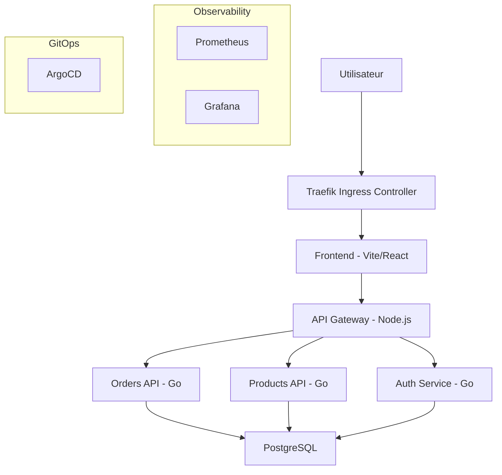

# Documentation de l'Architecture Technique - CloudShop

Ce document détaille les choix technologiques et architecturaux effectués pour le projet CloudShop, une application e-commerce basée sur une architecture microservices.

## 1. Vue d'Ensemble de l'Architecture

CloudShop repose sur une architecture découplée permettant une scalabilité indépendante de chaque composant. L'infrastructure est entièrement conteneurisée et orchestrée par Kubernetes.

## 2. Choix des Microservices

### Composants Applicatifs
- **Frontend ([frontend](./frontend))** : Développé avec **Vite** pour des performances optimales au build et au runtime. Servi via Nginx.
- **API Gateway ([api-gateway](./api-gateway))** : Implémenté en **Node.js/Express**. Il centralise les appels, expose les métriques Prometheus et gère le proxying vers les services backend.
- **Services Backend (Auth, Orders, Products)** : Développés en **Go**. Ce choix amène une forte typage, une gestion efficace de la concurrence et des binaires légers, idéaux pour Kubernetes.
- **Base de Données** : **PostgreSQL** géré sous forme de StatefulSet pour garantir la persistance des données et l'ordre des répliques.

## 3. Infrastructure & Kubernetes

### Orchestration
- **Kind** : Utilisé pour simuler localement un cluster multi-nœuds, facilitant le développement et le test de l'infrastructure réelle.
- **Traefik** : Choisi comme contrôleur Ingress pour sa modernité, sa configuration dynamique et son support natif de Kubernetes.
- **Namespaces** : Isolation des environnements (ex: `cloudshop-prod`, `argocd`, `monitoring`).

### Stratégies de Déploiement
- **Resource Quotas** : Limitation des ressources CPU/Mémoire par pod pour éviter que les services ne consomment tout le cluster (défini dans [deployments](./k8s/deployments)).
- **Health Checks** : Utilisation de Liveness et Readiness probes pour assurer la haute disponibilité.

## 4. Stratégie GitOps (ArgoCD)

Le déploiement suit les principes GitOps via **ArgoCD**. La configuration est répartie en couches ([argocd/apps](./argocd/apps)) :
- **Infrastructure** : Déploiement des namespaces et composants de base.
- **Database** : Gestion de l'état (PostgreSQL).
- **Backend/Frontend** : Déploiement des services applicatifs.

Cette approche garantit que l'état du cluster est toujours synchronisé avec le dépôt Git, permettant des rollbacks rapides et une traçabilité totale.

## 5. Observabilité & Sécurité

### Monitoring
- **Prometheus Operator** : Utilisation de ServiceMonitors pour la découverte automatique des cibles de scraping.
- **Grafana** : Tableaux de bord pour visualiser l'état de santé du système et les performances des API.

### Sécurité SRE
- **Trivy** : Intégration de scans de vulnérabilités sur les images Docker avant le déploiement.
- **Network Policies** (Prévu) : Limitation des flux réseaux entre les pods pour réduire la surface d'attaque.
- **Secrets Management** : Utilisation de Kubernetes Secrets (et potentiellement Vault ou SealedSecrets à l'avenir) pour les données sensibles.
