# Documentation de l'Architecture Technique - CloudShop
### Auteur: Steve Hoareau
Ce document justifie les choix techniques et certifie le bon fonctionnement de l'infrastructure CloudShop à travers quatre piliers : Conteneurisation, Orchestration, GitOps et Observabilité.

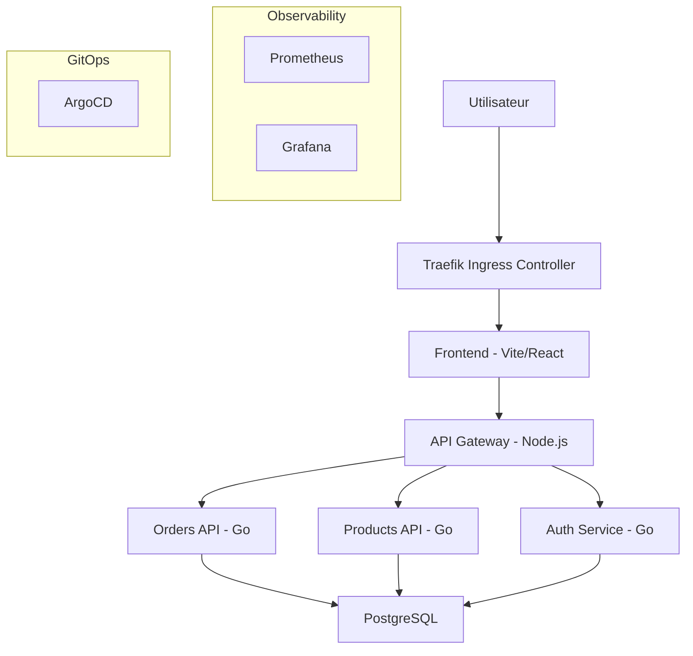

---

## Partie 1 : Conteneurisation (Docker)
**Objectif :** Prouver que les images sont optimisées, sécurisées et fonctionnelles.

### Taille des images optimisée
Nous utilisons des builds multi-étapes et des images de base légères (**Alpine**, **Slim**) pour minimiser l'empreinte disque et accélérer les déploiements.
- **Commande :** `docker compose images`
- **Résultat attendu :** Des tailles réduites (ex: Frontend < 50MB, Orders < 20MB) grâce à l'exclusion des outils de build des images finales.

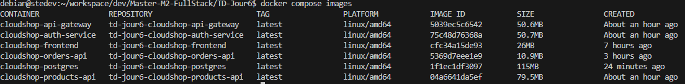

### Scan de vulnérabilités (Trivy)
La sécurité est intégrée dès la construction des images via des scans automatiques.
- **Commande :** `bash trivy-scan.sh`
- **Résultat attendu :** Un résumé montrant **0 CRITICAL**, prouvant l'intégrité de la chaîne d'approvisionnement logicielle.

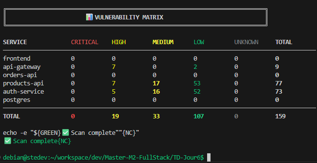

### Application fonctionnelle en local
- **Commande :** `docker compose ps`
- **Résultat attendu :** Tous les services (`api-gateway`, `auth-service`, `frontend`, etc.) affichent le statut **Up**.

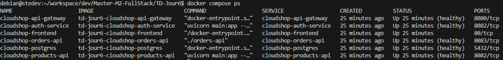

---

## Partie 2 : Orchestration (Kubernetes)
**Objectif :** Prouver que l'application est résiliente sur le cluster et accessible via l'Ingress.

### État des Pods
L'orchestration est gérée par Kubernetes (via **Kind** en local) avec des quotas de ressources et des sondes de santé.
- **Commande :** `kubectl get pods -n cloudshop-prod`
- **Résultat attendu :** Tous les pods sont en statut **Running** et **Ready 1/1**.

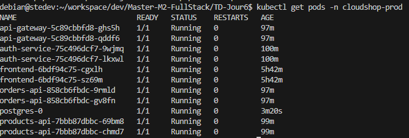

### Accès Frontend & API
- **Action (Navigateur) :** Ouvrir `https://cloudshop.stevehoareau.fr`.
- **Résultat attendu :** Chargement correct de l'interface CloudShop.
- **Commande (API) :** `curl -v http://cloudshop-orders-api.stevehoareau.fr/health`
- **Résultat attendu :** Réponse HTTP **200 OK** avec `{"status": "ok"}`.

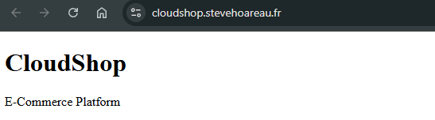
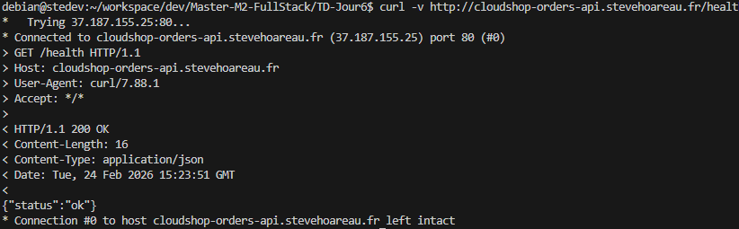
---

## Partie 3 : GitOps (ArgoCD)
**Objectif :** Prouver que le déploiement est automatisé et synchronisé avec le dépôt Git.

### Interface ArgoCD (Vue globale)
La stratégie de déploiement est pilotée par **ArgoCD** avec une approche multi-couches ([argocd/apps](./argocd/apps)).
- **Action :** Accéder à `https://cloudshop-argocd.stevehoareau.fr`.
- **Résultat attendu :** Affichage des 4 applications : `infrastructure`, `database`, `backend`, `frontend`.

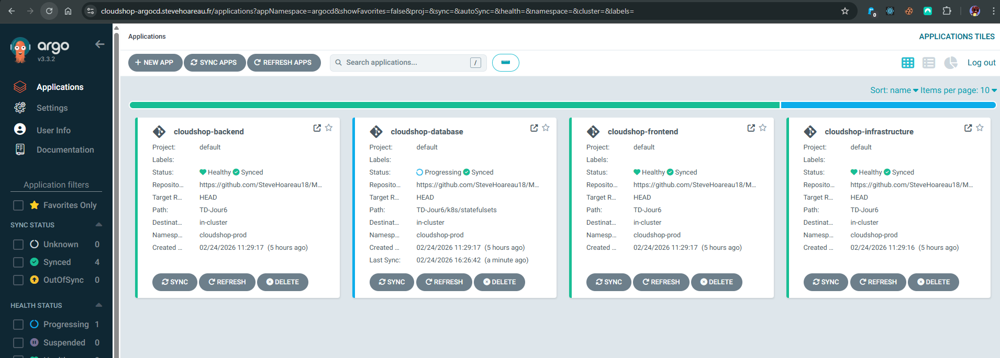

### Statut de synchronisation
- **Résultat attendu :** Icônes vertes **Synced** et **Healthy**, garantissant que l'état réel du cluster correspond à l'état désiré défini dans Git.

---

## Partie 4 : Observabilité (Prometheus & Grafana)
**Objectif :** Prouver que les métriques remontent et que le cycle de vie SRE est respecté.

### Cibles Prometheus (Targets)
- **Action :** Status > Targets dans l'interface Prometheus.
- **Résultat attendu :** Jobs `api-gateway`, `products-api`, etc., à l'état **UP**.

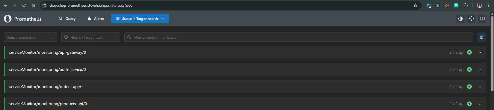

### Dashboard Grafana
- **Action :** Dashboard "CloudShop - Overview".
- **Résultat attendu :** Courbes de RPS, latence et erreurs visibles (nécessite le script de génération de trafic).

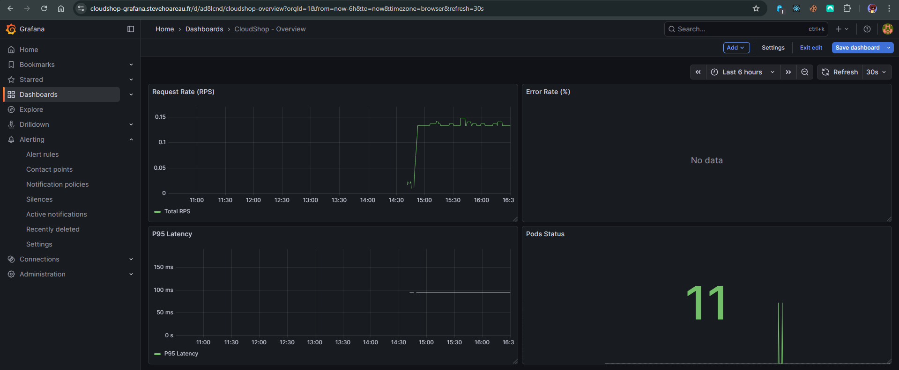

### Alertes actives (Firing)
- **Action :** Interface Prometheus > Alerts.
- **Résultat attendu :** Visualisation d'alertes (ex: `HighErrorRate`) en état **Firing** ou **Pending** lors d'un test de charge, validant le système de notification.

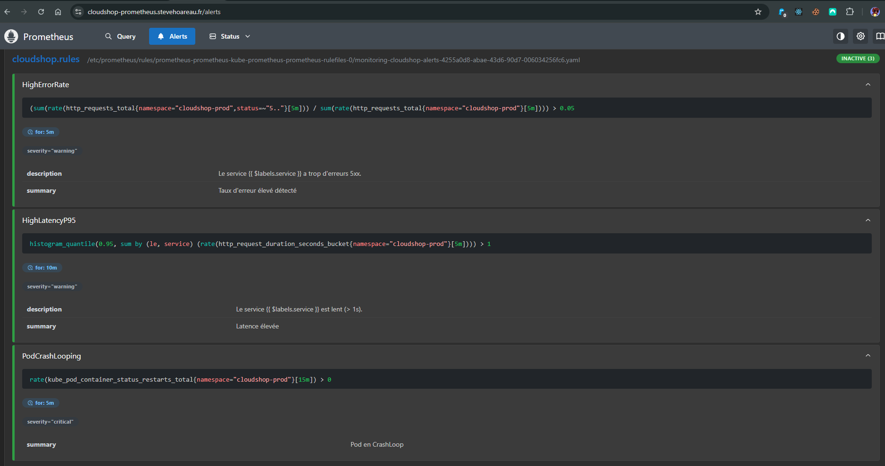